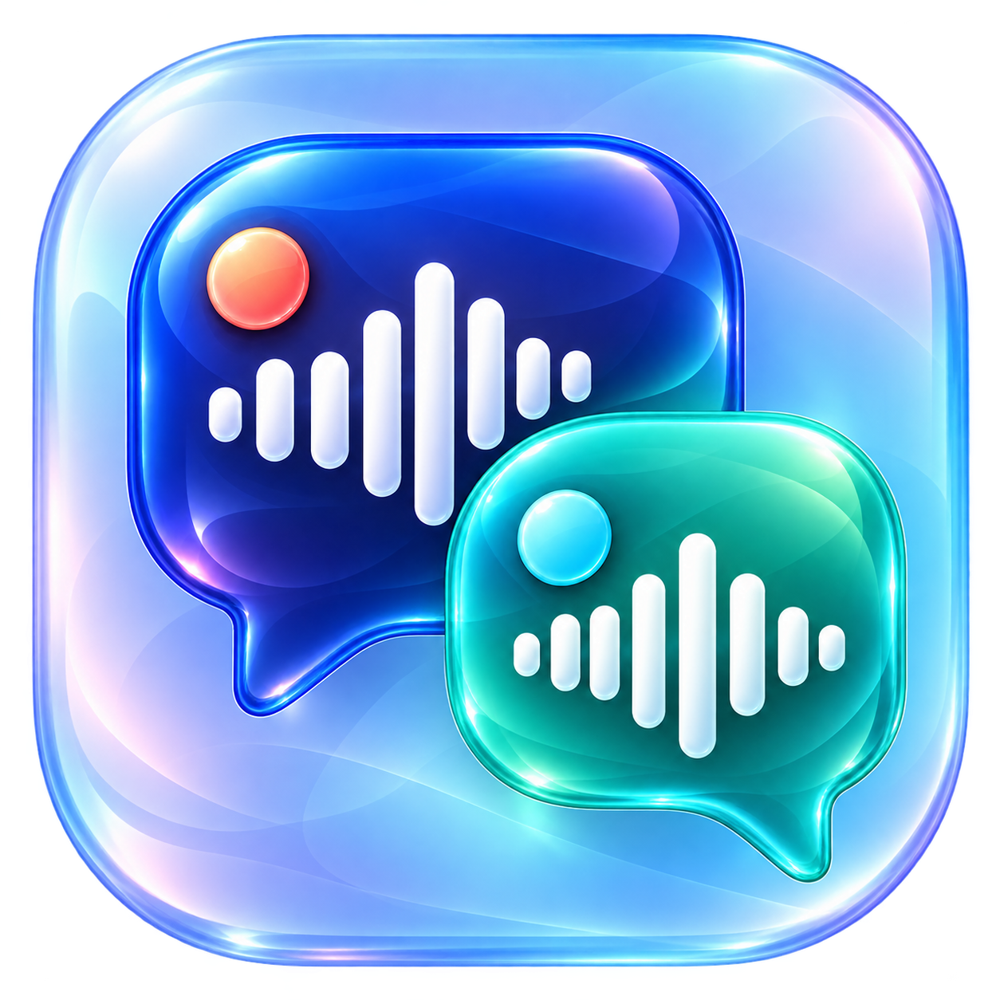

# Speaker Marks for macOS



A native Apple Silicon macOS app for on-device transcription. Choose a Whisper model, transcribe audio or video formats supported by FFmpeg, watch the transcript appear as it is recognized, and save `.txt`, `.srt`, and `.vtt` files beside the input. Optional speaker detection runs locally and adds editable speaker names to the transcript and subtitle exports.

## Open the app

Open `build/TranscribeToText.app`. Pick a Whisper model and language, choose an audio/video file, then select **Transcribe**. Use **Download Model** to download the selected model in advance; the button shows its download size and whether it is already installed. You can also transcribe immediately and the app will download the selected model on first use. Models are stored in `~/Library/Application Support/TranscribeToText/models/`; Large v3 is about 3 GB.

Transcript segments appear in the preview as Whisper recognizes them. **Cancel** stops an active transcription and keeps any text already shown in the preview; cancelled runs do not replace the output files. Model downloads can also be cancelled, and incomplete downloads are removed.

FFmpeg is used to read different audio/video formats. If the app cannot find it, install it with `brew install ffmpeg` and reopen the app. This build script makes an Apple Silicon app and builds the Whisper engine with Metal support:

```sh
./build-app.sh
```

The build requires Xcode Command Line Tools, CMake, Git, and Homebrew FFmpeg. The app bundle is unsigned, built for Apple Silicon, and may show a macOS security prompt when opened. Its bundled engines are whisper.cpp and sherpa-onnx.

## Speaker labels

**Detect speakers** is enabled by default. On its first use, the app downloads the small pyannote segmentation model and the English WeSpeaker embedding model (about 31 MB total) to `~/Library/Application Support/TranscribeToText/speaker-models/`. Diarization runs on-device; no audio is uploaded. The transcript shows editable speaker names, and changing a name updates all three exports. Diarization is an estimate: check labels on overlapping speech, very short replies, or noisy recordings.

## Model choices

- The picker offers Tiny, Base, Small, Medium, Large v1/v2/v3, Large v3 Turbo, and the Tiny.en/Base.en/Small.en/Medium.en English-only variants. Each choice displays a brief accuracy/speed description and approximate first download size.
- The **Download Model** button applies to the currently selected model, so users can prepare any option before transcribing. Downloaded models are marked in the interface.
- Large v3 is the default for maximum recognition accuracy. Large v3 Turbo is much faster, with some accuracy tradeoff. `.en` models only transcribe English.
- VAD is enabled automatically to avoid hallucinated text during long silence. TXT, SRT, and VTT are generated from the same local transcription.
- The speaker detector uses the pyannote segmentation model and WeSpeaker English speaker embeddings through sherpa-onnx. Model sources: https://github.com/k2-fsa/sherpa-onnx/releases/tag/speaker-segmentation-models and https://github.com/k2-fsa/sherpa-onnx/releases/tag/speaker-recongition-models.

## Credits and license

Speaker Marks is released under the MIT License; see [`LICENSE`](LICENSE). It builds on [whisper.cpp](https://github.com/ggml-org/whisper.cpp) (MIT) and [sherpa-onnx](https://github.com/k2-fsa/sherpa-onnx) (Apache-2.0). Their license texts are included in [`ThirdPartyLicenses/`](ThirdPartyLicenses/), and the build script copies them into the app bundle. FFmpeg is installed separately and is not bundled. Model files are downloaded from their upstream sources and carry their own licenses and access terms. See [`ThirdPartyNotices.md`](ThirdPartyNotices.md) for details.
